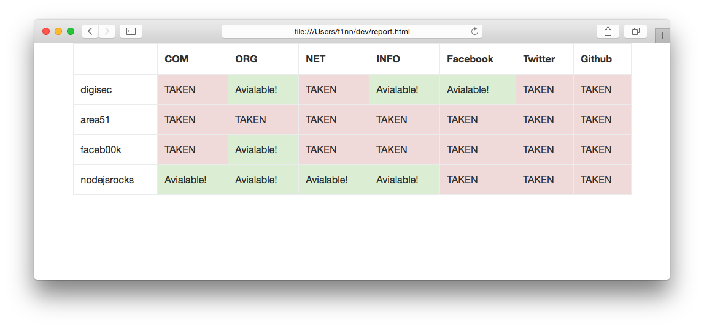

# cybersquatter

A simple tool for mass checking free names in different domain zones, social networks, etc. Generates readable HTML-reports. Example:

```
f1nns-mbp:dev f1nn$ cybersquatter digisec area51 faceb00k nodejsrocks
...
Written report for: digisec, area51, faceb00k, nodejsrocks
```

Output (`report.html`):



Simple and fast (~1 sec/name). **Use it for Good, Luke :).**

## Install

```
npm install -g cybersquatter
```

## Usage

```
cybersquatter <list of names to check, separated by space>
```
Like:
```
cybersquatter digisec area51 faceb00k nodejsrocks
```

This will create `report.html` in the current directory. If `report.html` already exists from previous scan, cybersquatter will just append new results to it.

## TODO ()

* improve DNS check, use whois for non-resolved domains
* add more social networks // services

## License

Copyright (c) 2016, Ilya Rusanen. (MIT License)

See LICENSE for more info.
